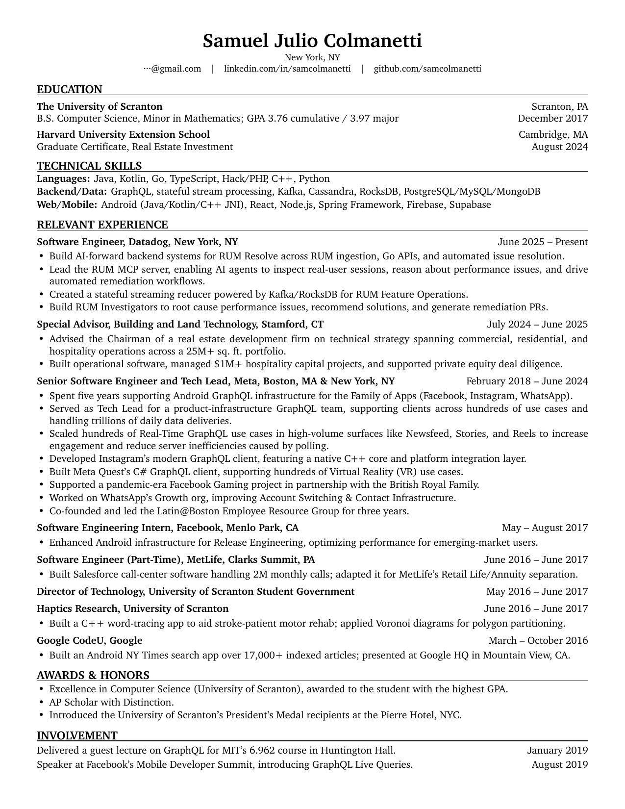

# resume-manager



A code-based LaTeX resume system. Content lives in plain `.tex` files using a small set
of semantic macros; all formatting lives in `resume.cls`. One command builds a polished,
ATS-friendly, single-page PDF.

## Prerequisites

- **xelatex** — ships with [MacTeX](https://tug.org/mactex/) or BasicTeX
- **Charter** system font — ships with macOS (required by `resume.cls`)
- **pdftotext** — optional, for quality checks (ships with MacTeX)

## Setup

```bash
git clone <this-repo>
cd resume-manager
mkdir resumes
cp resume-template.tex resumes/resume-yourname.tex
# edit resumes/resume-yourname.tex
make
open resumes/resume-yourname.pdf
```

`resumes/` is gitignored - your content and built PDFs never land in this repo.

To export a finished PDF to Google Drive, Dropbox, or any folder on your machine,
copy `config.local.mk.example` to `config.local.mk` (also gitignored) and set:

- `EXPORT_DIR` - destination folder (e.g. `~/Library/CloudStorage/GoogleDrive-.../Resumes/Current`)
- `EXPORT_NAME` - filename for the exported copy (e.g. `Sam Colmanetti Resume 2026.pdf`)

Then `make export FILE=resume-yourname` builds and drops the PDF there.

## Build

```bash
make                              # build all resumes/resume-*.tex -> resumes/
make resumes/resume-NAME.pdf     # build one file
make check                        # verify no resume content is tracked
make clean                        # remove build output
make export FILE=resume-NAME      # copy PDF to EXPORT_DIR (see config.local.mk)
```

## Macros

Content files use only these macros (all formatting stays in `resume.cls`):

| Macro | Purpose |
|-------|---------|
| `\name{...}` | Centered name header |
| `\location{City, ST}` | Optional centered line under the name |
| `\contact{a \sep b \sep c}` | Centered contact line |
| `\section{Title}` | Bold uppercase section heading + rule |
| `\edu{School}{Right}{Degree line}{Right}` | Two-line education entry |
| `\skill{Label}{values}` | `Label: values` skills line |
| `\entry{Role, Company, Location}{Dates}` | Bold experience header |
| `\begin{bullets} \item ... \end{bullets}` | Compact bullet list |
| `\oneline{Left}{Right}` | One-line entry with right-aligned text |

Never put spacing or font commands in a content file. Change `resume.cls` instead.

## House rules

- **One page.** Confirm the build log says `(1 page)` after every edit.
- **No em dashes** (`—`). Use commas, semicolons, or restructure.
- **No orphan lines.** No bullet wraps to a trailing line of 1-2 words.
- **ATS-friendly.** Single column, selectable text, standard font, no text in graphics.
